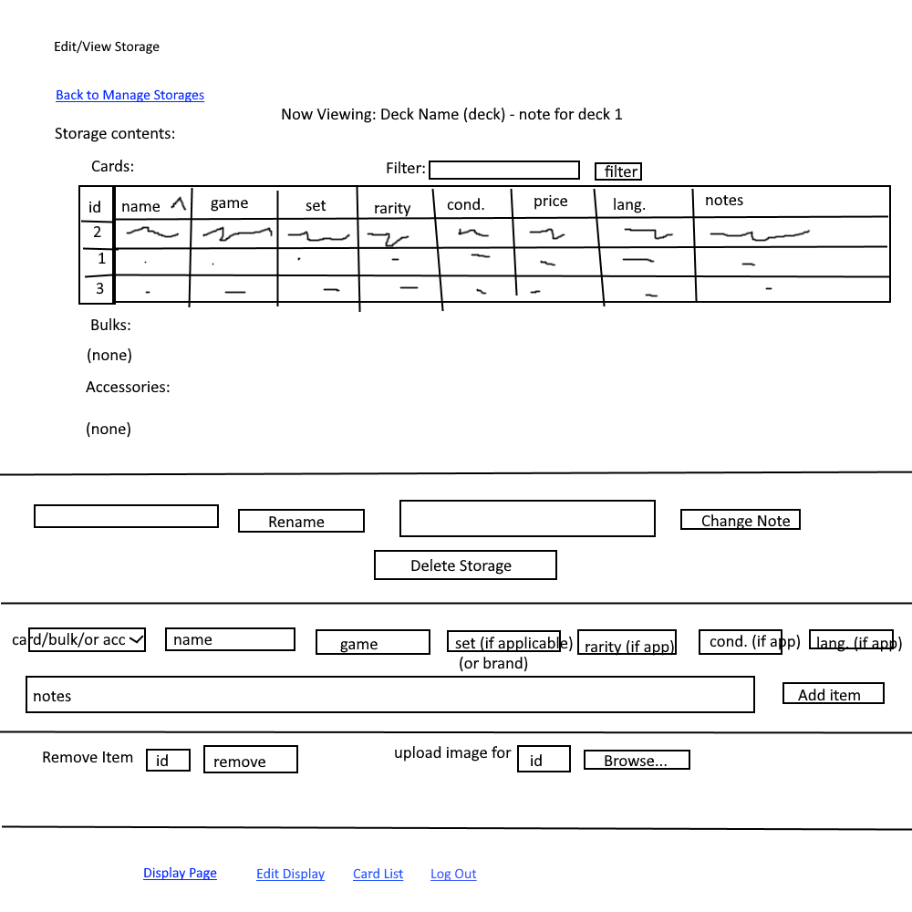
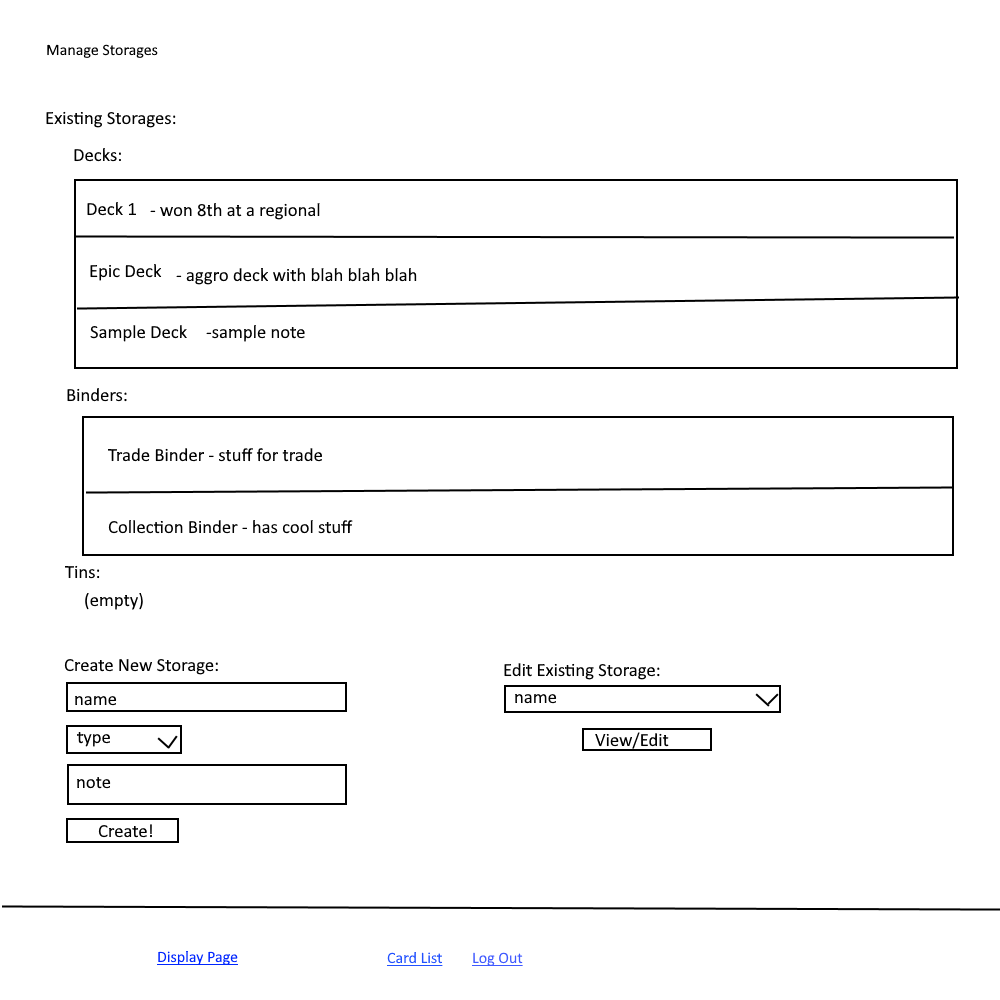
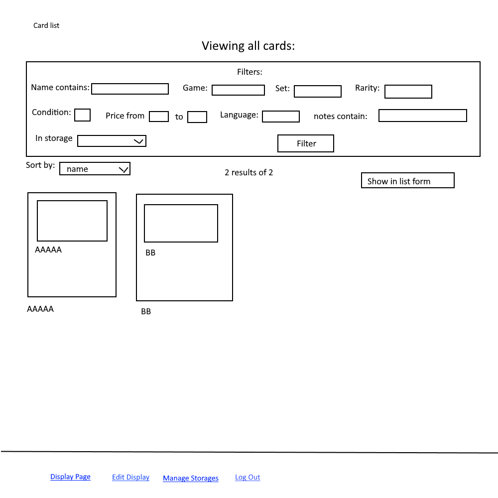
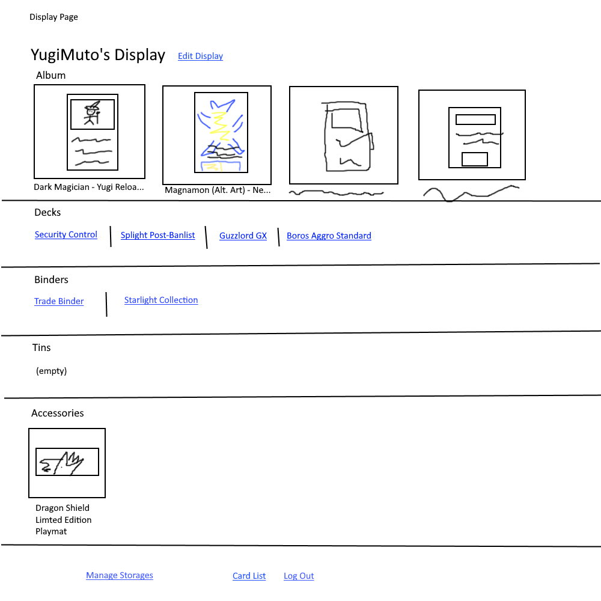
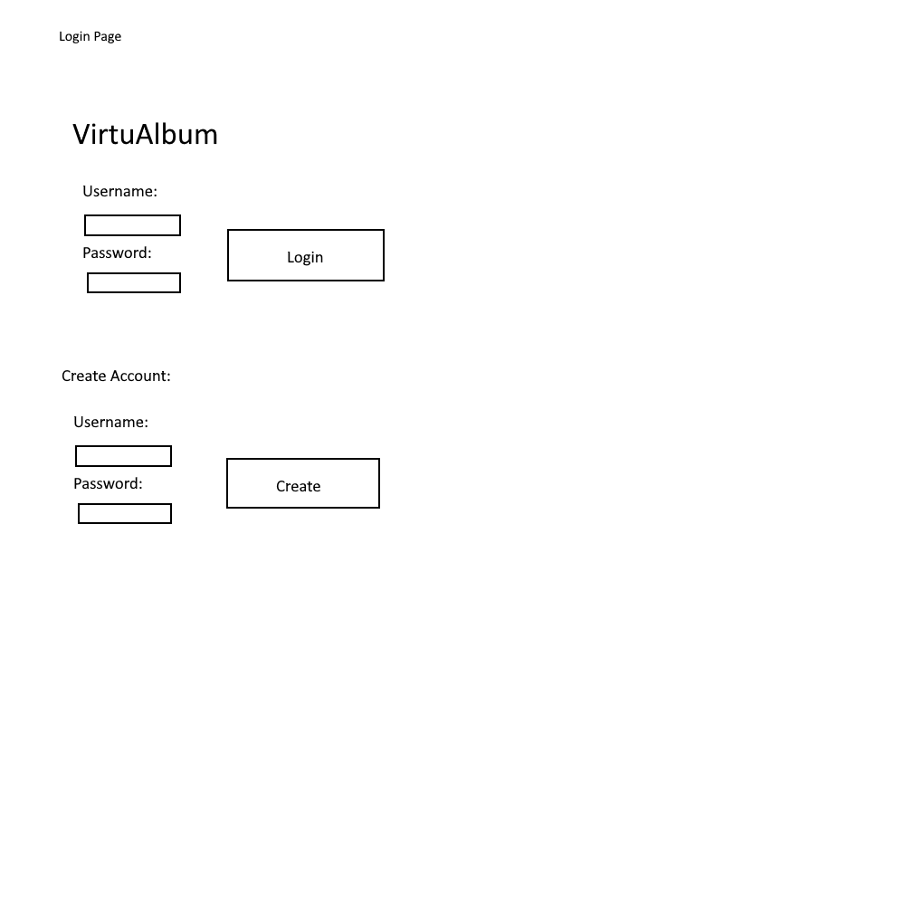
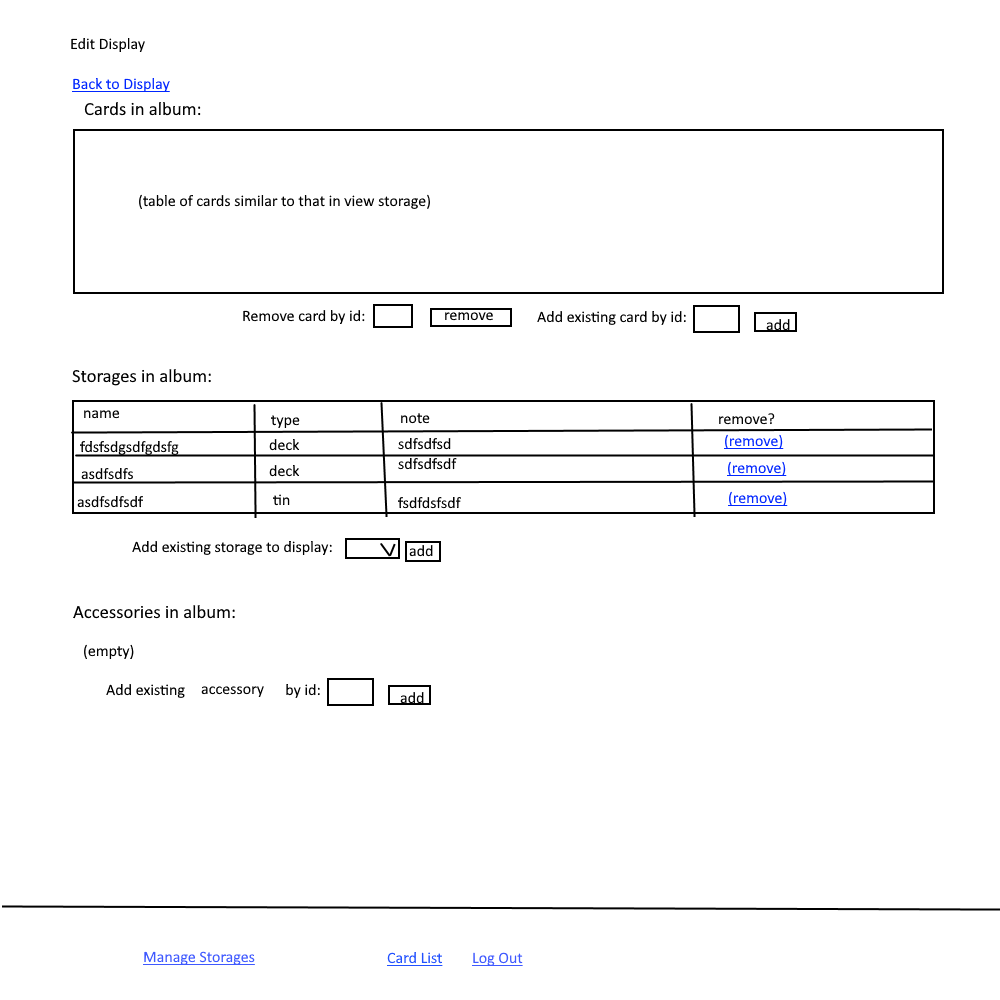

# VirtuAlbum

## Overview

Every hobbiest that has dabbled in the realm card collecting knows the frustrations of keeping tabs on their cards. With VirtuAlbum, players, collectors, and sellers can ditch those cramped excel files in favor of a user friendly interface. Users can log on to view their binders, deck boxes, and tins, modify them as trades, pulls, and purchases happen, and even display them. Within each storage, cards can be accessed with uploaded pictures, name, card game/collection, price, and more. This allows for easy valuation of parts of a collection, in addition to convenient ways to filter and sort from any set of cards the user owns. Users can also keep track of accessories such as dice, coins, and playmats.

IMPORTANT UPDATE FOR MILESTONE 3: I have decided to reduce the scope of my project to a hand tester, as I have been having a lot of trouble implementing just the research topics (still struggling after a couple days of pulling my hair out). Instead of a full functionality album uploader, my project will now allow the user to create multiple decks of custom cards. A user can then select a deck, have it be shuffled, and be dealt a hand which size is variable. 

## Data Model

The application will store Users, Storages, Display, Cards, Bulks, and Accessories

* each storage has a name, note, and type (binder, box, tin)
* each card has attributes name, game, set, rarity, condition, price, language, notes, and image
* each bulk has attributes name, game, size, language, notes, and image
* each accessory has attributes name, type (coin, die, mat, other), brand, notes, and image
* users can have multiple storages (via references)
* users can have one display (via reference)
* each storage can have multiple cards, bulks, and/or accessories (by embedding)
* a display can have multiple storages, accessories, and/or cards (via references)

An Example User:

```javascript
{
  username: "YugiMuto",
  hash:, // a password hash
  storages:, // an array of references to storage documents
  display: // reference to the user's display
}
```

An Example Storage with Embedded Items:

```javascript
{
  user: // a reference to a User object
  type: 'tin',
  name: "Pokemon Tin 3",
  items: [
    new Bulk("Fusion Strike Common Bulk", 'PTCG', 300, "English", "pulled from a box 10/22/2022"),
    new Card("Golisopod GX", 'PTCG', "Burning Shadows", "Secret Rare", "NM", 6.72, "English", "traded at local 9/15/2022"),
    new Card("Radiant Gardevoir", 'PTCG', "Lost Origin", "Radiant Rare", "LP", 0.90, "English", "purchased online 9/17/2022"),
    new Accessory("Holo Blastoise Coin", "coin", "TPC", "received from promotion")
  ],
  createdAt: // timestamp
}
```

An Example Display with References to Storages: 

```javascript
{
  user: // a reference to a User object
  items: [
    // references to storaged user decides to add here
  ]
}
```

Constructors for Card (same structure for Bulk and Accessory):

```javascript
function Card(name, game, set, rarity, condition, price, language, note, img = null) {
  this.name = name;
  this.game = game;
  this.set = set;
  this.rarity = rarity;
  this.condition = condition;
  this.price = price;
  this.language = language;
  this.note = note;
  this.img = img;
  this.id = IDCount; IDCount++; // IDCount is user var which increases each time a card, bulk, or accessory is created
}
```

## [Link to Commented First Draft Schema](db.mjs) 

(__TODO__: create a first draft of your Schemas in db.mjs and link to it)

## Wireframes

/manage-storages/deck1 - page for viewing or editing an existing storage



/manage-storages - page for showing all storages and creating new storages



/card-list - page for showing specific shopping list



/display - page showing the user's display



/login - login page for user, redirects to manage-storages if success



/display/edit - page to edit user display



## Site map

[Link to site map](documentation/site-map.png)

## User Stories or Use Cases

1. as non-registered user, I can register a new account with the site
2. as a user, I can log in to the site
3. as a user, I can create a new storage
4. as a user, I can add cards, bulk, accessories to existing storages
5. as a user, I can remove cards from existing storages
6. as a user, I can edit my display
7. as a user, I can view all my cards and filter them to my liking
8. as a user, I can remove existing storages
9. as a user, I can choose the layout in which I view my cards
10. as a user, I can attach images to my cards

## Research Topics

* (2 points) Tailwindcss
* (6 points) React

8 points total out of 8 required points


## [Link to Initial Main Project File](app.mjs) 

## Annotations / References Used

(__TODO__: list any tutorials/references/etc. that you've based your code off of)

