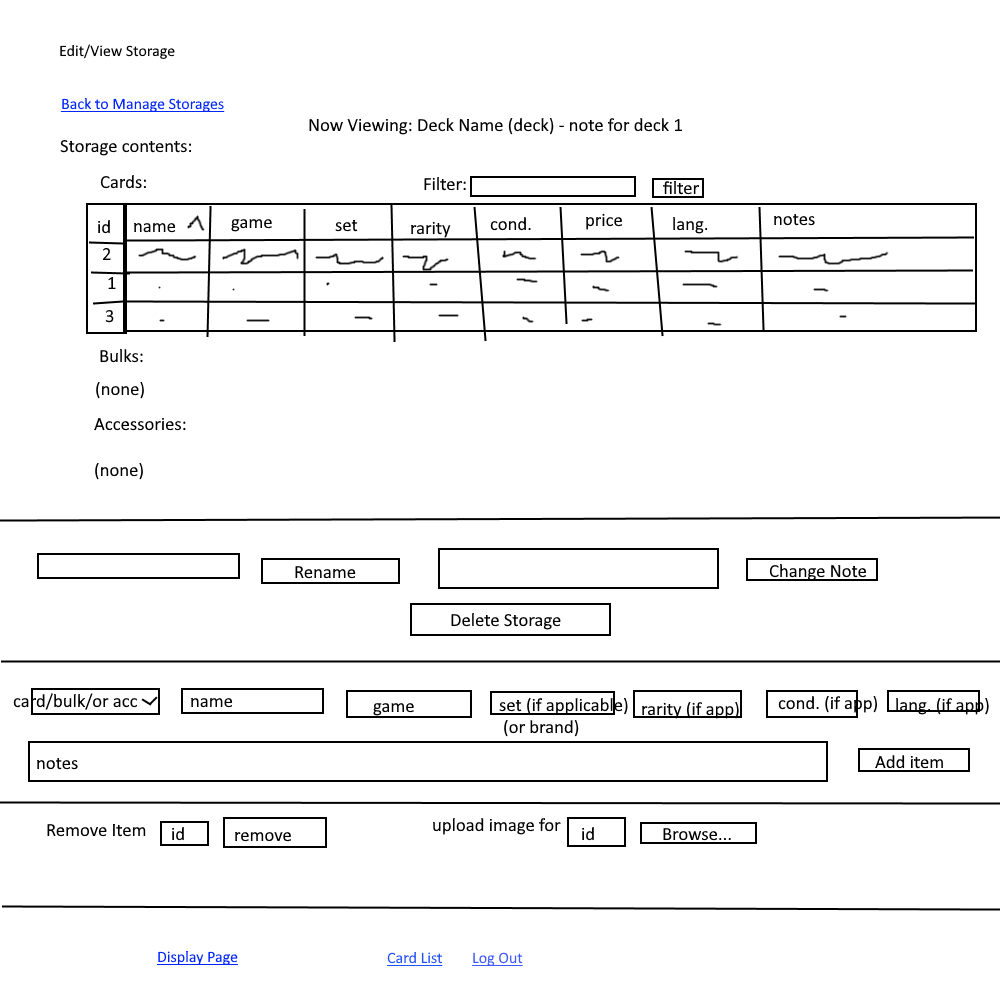
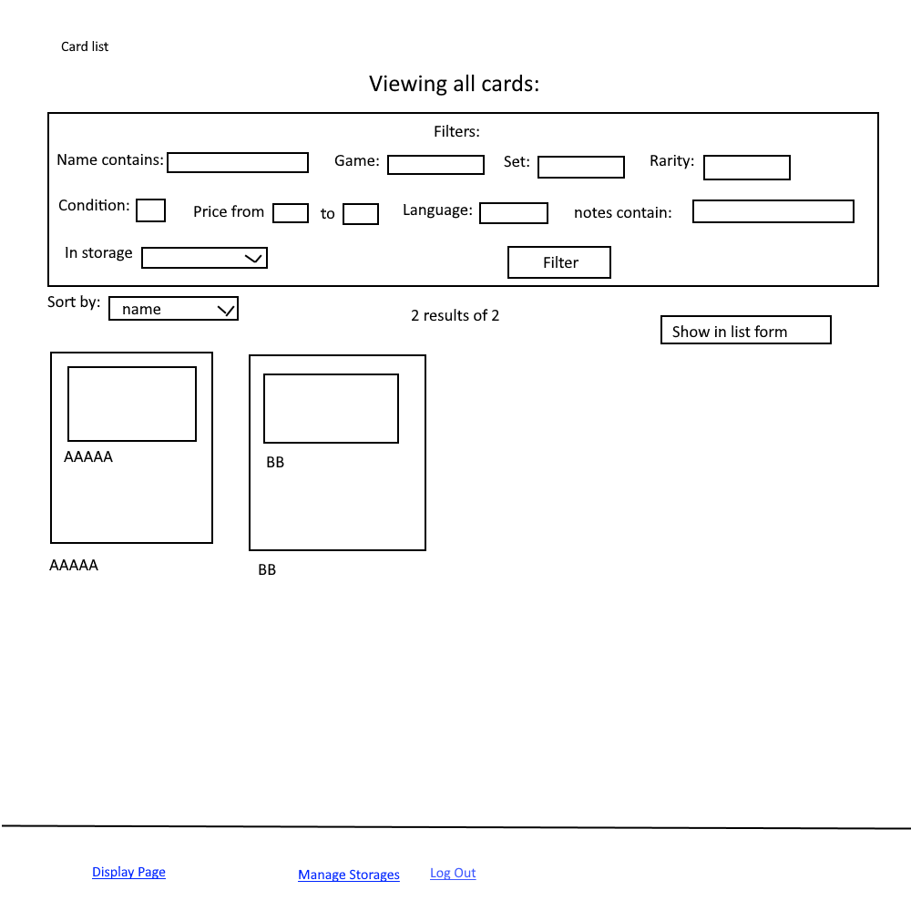

The content below is an example project proposal / requirements document. Replace the text below the lines marked "__TODO__" with details specific to your project. Remove the "TODO" lines.

# VirtuAlbum

## Overview

Every hobbiest that has dabbled in the realm card collecting knows the frustrations of keeping tabs on their cards. With VirtuAlbum, players, collectors, and sellers can ditch those cramped excel files in favor of a user friendly interface. Users can log on to view their binders, deck boxes, and tins, modify them as trades, pulls, and purchases happen, and even display them. Within each storage, cards can be accessed with uploaded pictures, name, card game/collection, price, and more. This allows for easy valuation of parts of a collection, in addition to convenient ways to filter and sort from any set of cards the user owns. Users can also keep track of accessories such as dice, coins, and playmats.

## Data Model

The application will store Users, Storages, Display, Cards, Bulks, and Accessories

* each storage has a name, note, and type (binder, box, tin)
* each card has attributes name, game, set, rarity, condition, price, language, notes, and image
* each bulk has attributes name, game, size, language, notes, and image
* each accessory has attributes name, type (coin, die, mat, other), brand, notes, and image
* users can have multiple storages (via references)
* users can have one display (via reference)
* each storage can have multiple cards, bulks, and/or accessories (by embedding)
* a display can have multiple storages, accessories, and/or cards (via references)

An Example User:

```javascript
{
  username: "YugiMuto",
  hash:, // a password hash
  storages:, // an array of references to storage documents
  display: // reference to the user's display
}
```

An Example Storage with Embedded Items:

```javascript
{
  user: // a reference to a User object
  type: 'tin',
  name: "Pokemon Tin 3",
  items: [
    new Bulk("Fusion Strike Common Bulk", 'PTCG', 300, "English", "pulled from a box 10/22/2022"),
    new Card("Golisopod GX", 'PTCG', "Burning Shadows", "Secret Rare", "NM", 6.72, "English", "traded at local 9/15/2022"),
    new Card("Radiant Gardevoir", 'PTCG', "Lost Origin", "Radiant Rare", "LP", 0.90, "English", "purchased online 9/17/2022"),
    new Accessory("Holo Blastoise Coin", "coin", "TPC", "received from promotion")
  ],
  createdAt: // timestamp
}
```

An Example Display with References to Storages: 

```javascript
{
  user: // a reference to a User object
  items: [
    // references to storaged user decides to add here
  ]
}
```

Constructors for Card (same structure for Bulk and Accessory):

```javascript
function Card(name, game, set, rarity, condition, price, language, note, img = null) {
  this.name = name;
  this.game = game;
  this.set = set;
  this.rarity = rarity;
  this.condition = condition;
  this.price = price;
  this.language = language;
  this.note = note;
  this.img = img;
  this.id = IDCount; IDCount++; // IDCount is user var which increases each time a card, bulk, or accessory is created
}
```

## [Link to Commented First Draft Schema](db.mjs) 

(__TODO__: create a first draft of your Schemas in db.mjs and link to it)

## Wireframes

/manage-storages/editview-storage/deck1 - page for viewing or editing an existing storage



/manage-storages - page for showing all storages and creating new storages


/card-list - page for showing specific shopping list



/display - page showing the user's display


## Site map

(__TODO__: draw out a site map that shows how pages are related to each other)

Here's a [complex example from wikipedia](https://upload.wikimedia.org/wikipedia/commons/2/20/Sitemap_google.jpg), but you can create one without the screenshots, drop shadows, etc. ... just names of pages and where they flow to.

## User Stories or Use Cases

(__TODO__: write out how your application will be used through [user stories](http://en.wikipedia.org/wiki/User_story#Format) and / or [use cases](https://en.wikipedia.org/wiki/Use_case))

1. as non-registered user, I can register a new account with the site
2. as a user, I can log in to the site
3. as a user, I can create a new grocery list
4. as a user, I can view all of the grocery lists I've created in a single list
5. as a user, I can add items to an existing grocery list
6. as a user, I can cross off items in an existing grocery list

## Research Topics

(__TODO__: the research topics that you're planning on working on along with their point values... and the total points of research topics listed)

* (5 points) Integrate user authentication
    * I'm going to be using passport for user authentication
    * And account has been made for testing; I'll email you the password
    * see <code>cs.nyu.edu/~jversoza/ait-final/register</code> for register page
    * see <code>cs.nyu.edu/~jversoza/ait-final/login</code> for login page
* (4 points) Perform client side form validation using a JavaScript library
    * see <code>cs.nyu.edu/~jversoza/ait-final/my-form</code>
    * if you put in a number that's greater than 5, an error message will appear in the dom
* (5 points) vue.js
    * used vue.js as the frontend framework; it's a challenging library to learn, so I've assigned it 5 points

10 points total out of 8 required points (___TODO__: addtional points will __not__ count for extra credit)


## [Link to Initial Main Project File](app.mjs) 

(__TODO__: create a skeleton Express application with a package.json, app.mjs, views folder, etc. ... and link to your initial app.mjs)

## Annotations / References Used

(__TODO__: list any tutorials/references/etc. that you've based your code off of)

1. [passport.js authentication docs](http://passportjs.org/docs) - (add link to source code that was based on this)
2. [tutorial on vue.js](https://vuejs.org/v2/guide/) - (add link to source code that was based on this)

